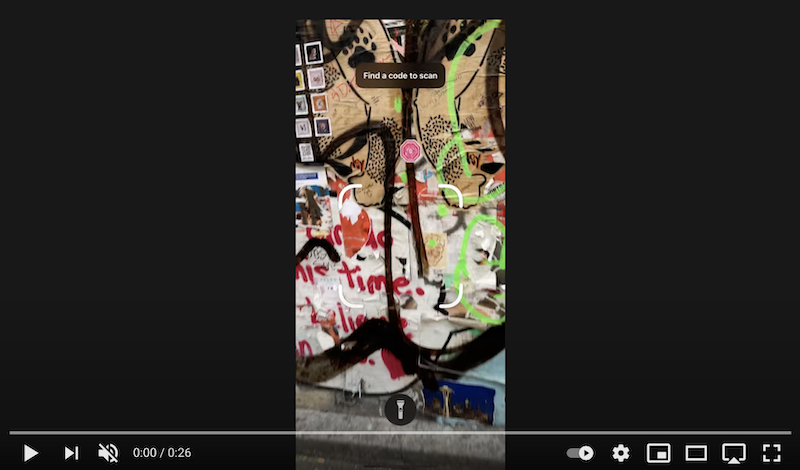

# Beatsy App Clip Codes [WIP]

App Clip Codes for [Beasty][app] let you create unique AR music experiences for people to discover in the world. You can use them to hype an upcoming release or you can design a musical and visual experiences for a specific location.

 
    

The document describes what you can create using Beatsy App Clip codes. If you would like to create an app clip code, please [file an issue][issues] or [reach out][contact] and I will work with you to set one up.

### Table of contents

- [Why Beatsy?](#why-beatsy)
- [Why App Clip Codes?](#why-app-clip-codes)
- [Custom Beatsy app clip codes](#custom-beatsy-app-clip-codes)
- [Visualizer Effects](#visualizer-effects)

## Why Beatsy?

[Beatsy][app] is a free iOS app that distorts the real world with music. You can make a wall bulge outward with a bass note or transform a street into a rolling wave of notes for example.

Beatsy's unique style of AR is eye-catching and fun. While post AR apps add overlays onto the real world, Beatsy makes you see an experience the real world differently. It also makes you experience your music differently too.

## Why App Clip Codes?

[App clip codes](https://developer.apple.com/design/human-interface-guidelines/app-clips/overview/app-clip-codes/) are QR-style designs that iPhone users can scan to launch small app experiences without having to install anything. Beatsy links these codes to specific audio and augmented reality visualizer effect. When a user scans a Beatsy app clip code a minimal version of Beatsy will be launched, the link audio will start playing, and the augmented reality effect will be applied to the world around the code.

You can post App Clip Codes using stickers, posters, or even stencils. With Beatsy, the surface you place the code on also becomes the surface that the music distorts when a user scans the app.

App Clip codes make music discovery interactive and physical. You can tailor individual codes to specific locations or even make finding the codes out in the real world part of the experience.

## Custom Beatsy app clip codes

If you are a musician and would like to create a custom code, just [file an issue][issues] or [let me know][contact]. These codes are free to create and you can use it however you'd like.

The rest of this document describes how you can customize your App Clip code and what information I will need to create a new code for for you. When you reach out, please try to include as much information as possible so that we can quickly setup a code. Don't worry if you aren't sure about some parts though as I can help walk you through the process.

**Required Info**

- mp3 for the audio. This should be streaming quality (around 192 kbps or so).

    You must also prove that you are the copyright holder of the audio and give me permission to make it available for Beatsy users. 

- Song title. This is displayed in the app when your song is playing and will also be displayed when launching from the app clip.

- Visualizer size in meters.

    This controls how large the visualizer will be. Keep in mind that the visualizer will be displayed at the location of the app clip code in the real world.

- Visualizer settings.

    Look over the visualizer effects section below and tell me how you'd like to configure the visualizer itself. If you are using the `video` visualizer, please also include the video mp4 file.

**Optional Info**

- App clip code color settings

    If you are not able to [generate an app clip code yourself](https://developer.apple.com/documentation/app_clips/creating_app_clip_codes/creating_app_clip_codes_with_the_app_clip_code_generator), I can generate a SVG of your app clip code. To do this, I need a foreground and background color to use. Keep in mind that these must be somewhat high contrast to so that users can scan them with their phones.

- Song link.

    If provided, Beatsy will shows a button in the bottom bar that opens this link. You can use this to link to your homepage or primary social media account, or to a webpage for the specific song

- Enable spatial audio?

    If enabled, the music will be played as if it were coming from the position of the visualizer in the world. Spatial audio is disabled by default.

**What you get**

Once everything looks good, I will share a custom app clip code url and App Clip Code image (as an `svg` or `png`) for you to use. You are free to use this image however you'd like. The app clip code will be enabled as soon as I enter all the info and upload the song.

If you'd like to make any changes to the App Clip after it has been created, please just let me know. Be sure to include the url of the App Clip you'd like to change.

## Visualizer Effects

Each app clip can use one of Beatsy's built-in visualizer effects or provide a completely custom experience with a displacement video.

Here's quick overview of the available visualizers effects and how they can be customized:

### Speaker

The speaker visualizer distorts surfaces to make them look like a giant speaker. The distortion responds to music, with bass notes causing large, slow moving waves while treble notes create smaller, faster waves.

**Parameters**

- `amplitude` — The max amplitude (height) of the visualizer.

    This is relative to the visualizer's size. An app clip that sets `position.scale = 3` for example with `amplitude = 0.5`, would be at most 1.5 meters high (`3 * 0.5`).

- `speed` — How fast the waves of the visualizer move. A speed of zero will create standing waves.

### Displacement Video

The video visualizer lets you create fully custom visualizations specifically for your audio. It uses a [displacement map](https://en.wikipedia.org/wiki/Displacement_mapping) to distort the surface, which enables arbitrary effects.

**Parameters**

- `amplitude` — The max amplitude (height) of displacement for the visualizer.

    This is relative to the visualizer size. A visualizer that is 3 meters in side with `amplitude = 0.5` for example, would be at most 1.5 meters high (`3 * 0.5`). This maximum displacement would only be reached for pure white pixels. Grey pixels would have intermediate displacements, while pure black pixels will be undistorted. 

**Video**

Each pixel in the video specifies how far that part of the surface will be shifted upwards in the AR effect. Parts of the plane under black pixels will have zero displacement, while parts under white pixels will be displaced to the maximum visualizer height (which is controlled by `amplitude`). Grey pixels will have intermediate levels of displacement.

Here's an example displacement video along with the resulting effect:

❗ TODO

Some basic guidelines for the displacement video:

- Mp4.
- Monochrome.
- Square of around 400x400px.
- No audio.

If the displacement video is shorter than the song, the video will looped during playback. You can use this to loop a short seamless animation.

[app]: https://apps.apple.com/us/app/beatsy/id1543162330
[contact]: https://blog.mattbierner.com/about/
[issues]: https://github.com/mattbierner/beatsy-app-clip-codes/issues