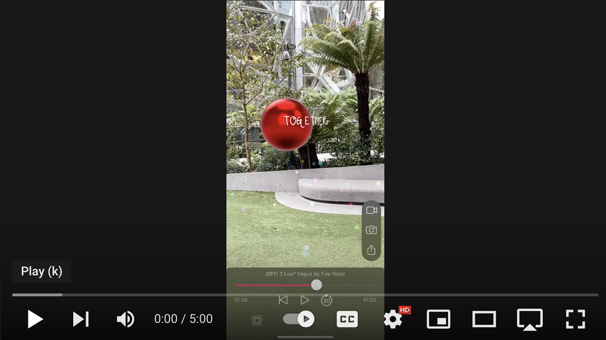

# Beatsy Clips

Clips for [Beatsy][app] let musicians create unique AR music experiences for people to discover in the world. You can use these codes to hype an upcoming musical release or you can design unique auditory and visual experiences for a 
specific physical space.

The video below demonstrates what you can create using 

 
    

If using [Beatsy][app] with your music sounds interesting, please [file an issue][issues] or [reach out][contact] and I will work with you to on a custom clip for Beatsy. No technical expertise is needed, we'll implement everything for you. We're just looking for creative musicians with a distinct artistic vision.

[app]: https://apps.apple.com/us/app/beatsy/id1543162330
[contact]: https://rarerealities.com/about/
[issues]: https://github.com/mattbierner/beatsy-app-clip-codes/issues